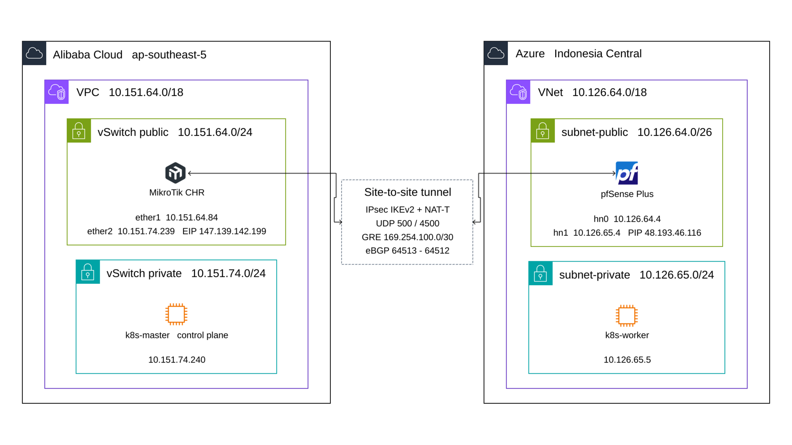
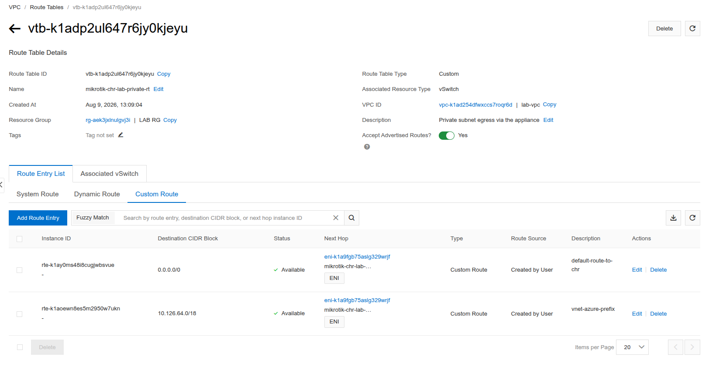
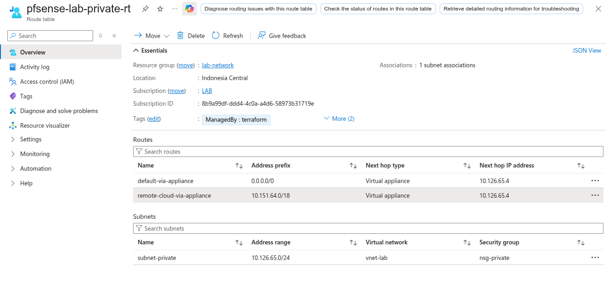
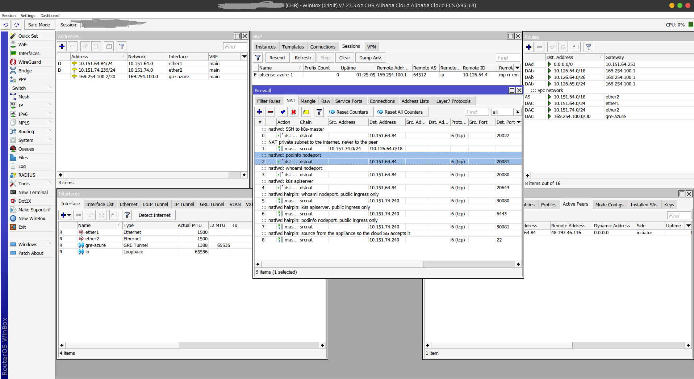
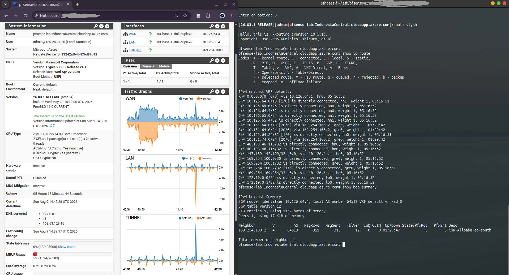
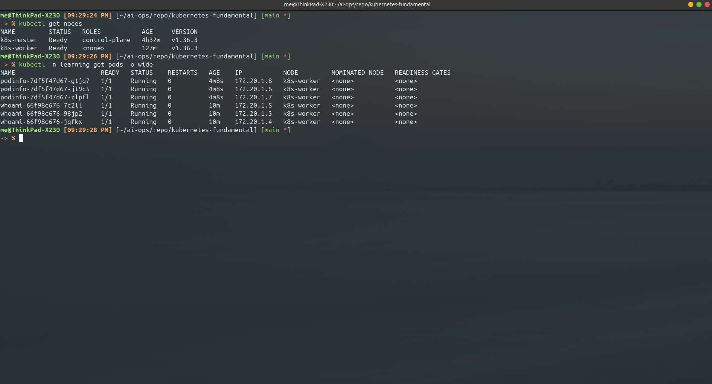
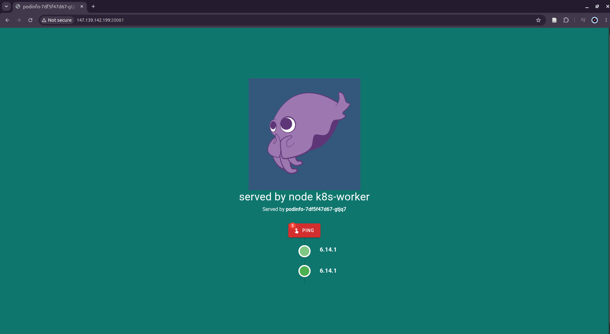

# Multi-cloud tunnel: MikroTik CHR ↔ pfSense, routed with BGP

A working site-to-site link between two public clouds, built with appliances
rather than the managed VPN products: **IPsec** for transport, a **GRE tunnel**
carrying a point-to-point /30, and **eBGP** over that /30 exchanging each
cloud's prefixes dynamically.

The end state is ordinary routing. A VM on one cloud's private subnet reaches a
VM on the other's by its real address, with no NAT in between, and both still
reach the internet through their local appliance.



## Why this exists

Before this I connected AWS and Google Cloud using each provider's own managed
HA VPN with BGP — four IPsec tunnels with ECMP, a Cloud Router on one side and a
Virtual Private Gateway on the other. That project is documented separately in
[gcp-aws-conn](https://github.com/andre4freelance/gcp-aws-conn).

It worked, but every moving part was somebody else's product: the tunnel, the
routing, the failover. That left an obvious question — what does the same
connection look like when **you** own both endpoints, the way you would on
premises? This repository is that experiment: the same cross-cloud link, built
out of appliances you configure yourself.

## Why an appliance, and why these two

The choice of MikroTik CHR and pfSense carries no significance beyond
availability. The design is deliberately **vendor-agnostic**: the only
requirement either end has to meet is IPsec and BGP. Swap in a Cisco, a
FortiGate, a VyOS, a Linux box running strongSwan and FRR — the topology and
the logic do not change, only the syntax does.

Using two *different* vendors was itself the point. Anything that only works
because both ends share an implementation would have been caught here.

## Why IPsec first, then BGP

Because that is the shape a managed site-to-site VPN already has. Across the
providers I have worked with, the pattern is the same in every one: establish
the tunnel, then run BGP inside it to exchange prefixes dynamically.

Keeping that shape makes the configuration portable in every direction:

- an appliance can be replaced by the cloud's native VPN, and the peer does not
  notice — the tunnel parameters and the BGP session are the same;
- a native cloud VPN can be moved onto an appliance when you need something the
  managed product will not do;
- an on-premises router or firewall migrating into the cloud is rebuilt as an
  appliance and reconnected, rather than redesigned.

The alternative — static routes — would have been simpler to stand up and would
have thrown all of that away. With BGP, each side learns the other's prefixes
and reacts to changes without anyone editing a route table.

## Why this is harder than it looks

**Neither appliance owns its public address.** Both clouds present the public IP
through 1:1 NAT — the interface only ever carries a private address. Almost
every non-obvious part of this configuration follows from that one fact, and it
is why copying a standard site-to-site recipe does not work.

The other recurring theme: **three firewalls, not one.** Each hop has its own —
the cloud security group on each side, and the appliance's own ruleset in the
middle. The middle one is invisible from outside and accounts for most of the
time lost.

## What is here

| Path | |
|---|---|
| `terraform/alibaba-chr/` | Provisions the CHR: EIP, two NICs, security-group rules, private route table |
| `terraform/azure-pfsense/` | Provisions pfSense: public IP, two NICs, NSG rules on both layers, private route table |
| `routeros/chr-tunnel.rsc.tmpl` | RouterOS side, templated |
| `pfsense/apply-tunnel.php` | pfSense side, idempotent, writes config only |
| `apply.sh` | Renders the templates from `vars.env` and pushes them |
| `docs/bgp-stability.md` | Why the BGP session flapped, and the three unrelated causes behind it |
| `diagram/topology.yaml` | Diagram-as-code source for the topology image, so it can be regenerated when the design changes |

The split is deliberate. Terraform builds the machines and everything the
cloud controls — addresses, NICs, firewalls, route tables. The templates
configure what runs *inside* the appliances, which no Terraform provider
manages. A rebuilt VM gets its configuration back from here, not from state.

## Build it

**1. Provision the infrastructure**, one stack per cloud:

```bash
cd terraform/alibaba-chr   && cp terraform.tfvars.example terraform.tfvars && terraform init && terraform apply
cd terraform/azure-pfsense && cp terraform.tfvars.example terraform.tfvars && terraform init && terraform apply
```

Each stack expects a VPC/VNet, subnets and security groups to already exist and
references them by id — it never creates or modifies them, so it can be dropped
into an environment somebody else owns. Note the outputs: the two public
addresses and the two private ones.

Then put each side's public address into the other's `ipsec_peer_ip_cidr` and
re-apply, so both cloud firewalls open the tunnel to the peer.

**2. Configure the appliances:**

```bash
cp vars.env.example vars.env      # fill in, including a real IPSEC_PSK
./apply.sh render                 # inspect what will be sent; the PSK is redacted
CHR_SSH=user@<chr-ip> ./apply.sh chr
PF_SSH=admin@<pf-ip>  ./apply.sh pfsense
ssh admin@<pf-ip> reboot          # pfSense applies on boot, deliberately
```

Verify in this order — each step makes the next one worth attempting:

```bash
swanctl --list-sas                        # SA up, and BOTH direction counters moving
ping <peer tunnel ip>                     # the /30 works
vtysh -c "show bgp summary"               # established, prefixes received
ping -S <local private> <peer private>    # the actual goal
```

## Routing the private subnets through the appliances

A tunnel that passes traffic is not the same as a network that uses it. Each
cloud still has to be told that the peer's prefix, and the default route, leave
through the appliance.

The two clouds differ here in a way that matters. Alibaba ships a single
**System** route table shared by every vSwitch, so scoping a default route to
the private subnet requires a custom route table and re-associating that
vSwitch. Its next hop names an **ENI**, which survives the appliance changing
address.



Azure starts with no route table at all, so one is created freely — but its next
hop can only be an **IP address**, never a NIC. The appliance's private address
must therefore be static, or every route in the table silently points at
nothing the moment it moves.



## The link, running

On the RouterOS side: the GRE interface up, the BGP session established with the
peer, and the routes learned from the other cloud installed in the main table.



On the pfSense side: both IPsec phases up, the tunnel interface carrying its
half of the /30, and FRR showing the peer's prefixes with the tunnel as their
next hop.



## Validation: a Kubernetes cluster split across two clouds

Pinging between subnets proves reachability. It does not prove the link is good
enough to carry a real distributed system, which keeps long-lived TCP sessions
open, moves bulk data, and builds its own encapsulated network on top of yours.

So the test was a single Kubernetes cluster whose nodes sit in different
subnets, different VPCs, and different clouds:

| | Node | Location |
|---|---|---|
| Control plane | `k8s-master` | Alibaba, private vSwitch |
| Worker | `k8s-worker` | Azure, private subnet |

Neither node has a public address. The worker joins the API server by the
control plane's **private** address, across the tunnel, and everything the
cluster does afterwards — scheduling, health checks, logs, exec — crosses the
same path.



The pod network is Flannel in VXLAN mode, with its MTU set from the tunnel's
**measured** path MTU rather than the interface default. This is the one number
worth transferring to any similar build: an overlay sized for a 1500-byte
network will appear to work, schedule pods normally, and then hang on the first
large transfer.

Because the control-plane node carries the standard `NoSchedule` taint, every
application pod is scheduled onto the worker in the other cloud. A request
entering through a NodePort on the Alibaba node is therefore forwarded across
the tunnel before any pod answers it — which is exactly the property being
tested. The demo application reports the node that served it:



The page is reached through the Alibaba appliance, and it answers `served by
node k8s-worker` — a pod running in Azure. Pod-to-pod traffic between the two
clouds runs at tunnel speed with no packet loss, and `kubectl logs` and
`kubectl exec` work against pods on the remote node.

That is the result the whole build was for: two clouds, one routed network, and
a workload that neither knows nor cares which side of the tunnel it is on.

## The things that cost the most time

Every item below was a real failure, not a hypothetical.

**Open UDP 500 and 4500 — nothing else.** Behind NAT, IKE always negotiates
NAT-T and every ESP packet is UDP-encapsulated. A rule for ESP (IP protocol 50)
never matches a single packet.

**The SA can establish, decrypt perfectly, and send nothing.** If one side's GRE
sources from its private address while the peer's policy names its public one,
the selectors do not mirror and egress matches no policy. The signature is
unmistakable once you know it:

```
in  1872 bytes,  39 packets     <- decrypts fine
out    0 bytes,   0 packets     <- sends nothing, no error anywhere
```

The fix is to give the appliance its own public address as a virtual IP and
source the tunnel from it. Read the per-direction counters early; an
`INSTALLED` SA proves nothing about traffic.

**Never advertise the tunnel's own transport.** `redistribute connected` picked
up that virtual IP — the very address the peer's tunnel points at. The peer
installed a route to the tunnel endpoint *through the tunnel*, and the link
collapsed. Use explicit `network` statements, and filter it inbound at the peer
as well.

**`network X` advertises nothing unless X is in the routing table.** Neither
cloud gives you a connected route for the whole VPC/VNet, only the per-subnet
prefixes. A `network` statement with no matching route is accepted in silence
and advertises nothing — in `show bgp` the prefix appears without the `*>`
valid marker, which is easy to skim past. Add a static route for the supernet,
with an **interface** next-hop so the config travels between environments.

**Outbound NAT will quietly rewrite the tunnel's replies.** pfSense's automatic
outbound NAT covers every interface, tunnel included. Replies leave with their
source rewritten to the tunnel address, the far end receives an answer from a
host it never contacted, and drops it. The tell: pings to and from the *tunnel*
addresses work while LAN-to-LAN does not. A parenthesised address in
`pfctl -ss` is the proof.

**A GRE keepalive nobody answers.** RouterOS marks a GRE interface down after
three unanswered keepalives. FreeBSD's `gre(4)` never answers them, so the
tunnel flapped every few seconds and took BGP with it. Unset it — the BGP hold
timer and IPsec DPD already cover liveness.

**pfSense filter rules use `address` for a literal CIDR, not `network`.**
`network` means an interface name or alias. A filter rule using `network` with a
CIDR is skipped silently by the generator: present in `config.xml`, absent from
`pfctl -sr`, no error anywhere. (NAT rules are the exception, where `network`
does take a CIDR — which is what makes this so easy to get wrong.)

There is a longer write-up of the BGP session that dropped every few minutes,
and the three separate causes behind it, in
[docs/bgp-stability.md](docs/bgp-stability.md). One of them was the firewall
dropping its own SYN-ACK to the peer.

## Secrets

`vars.env` holds the pre-shared key and is gitignored, as are rendered configs
and device backups. Take backups with:

```bash
ssh <pfsense> 'cat /cf/conf/config.xml' > pfsense-config.xml
ssh <routeros> '/export'                > routeros-export.rsc
chmod 600 *.xml *.rsc
```

Both contain pre-shared keys and password hashes. Keep them out of any repo.

## License

MIT — see [LICENSE](LICENSE).
